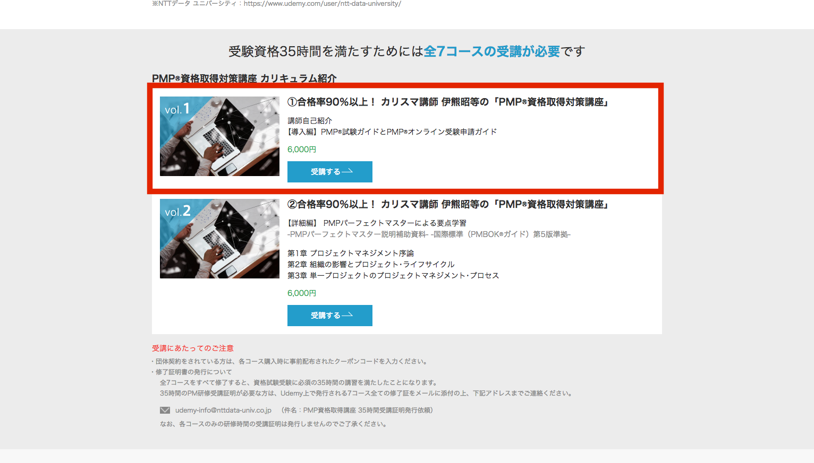
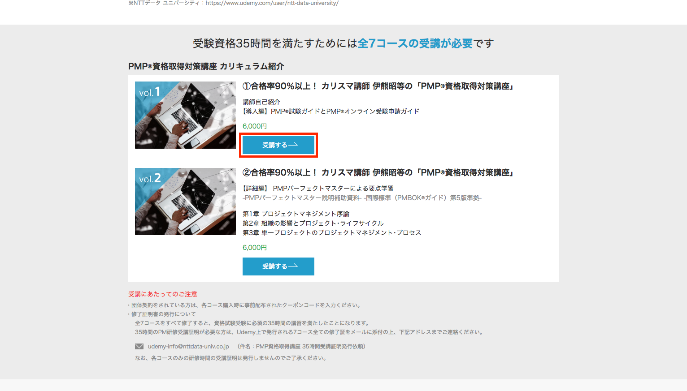

# Improvement01
下記指示に従って修正を行ってください。

## 修正内容
「PMP資格取得対策講座 カリキュラム」の一覧の linkの範囲が全体的にかかっていますが、それを「受講する」のボタンだけの範囲でlinkを設定してください。
デザインは全く変えずそのままでお願いいたします。また、クリックしたら別タブで開くようにしてください。
- 一覧のそれぞれのコンテンツのlinkの範囲を変更する。
- クリックしたら別タブで開くようにする。

## 補足
内容を画像で説明いたします。
現状だと、Before画像の赤枠で囲われた部分がlinkになっていますが、それをAfter画像のlink範囲に変更してください。

**現状の状態**
#### Before

#### After
**修正後**
